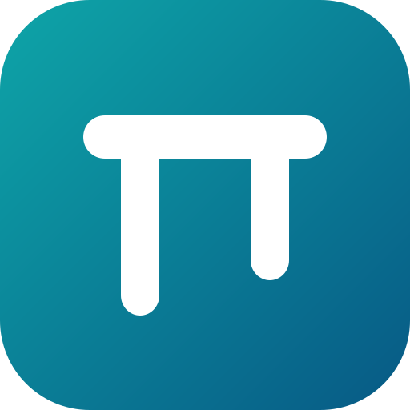
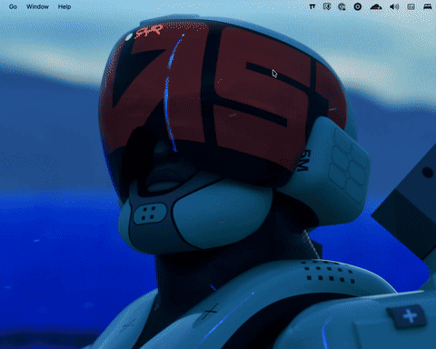

#  Standing Desk

Control an IKEA IDÅSEN standing desk from Raycast or iPhone through Bluetooth Low Energy (BLE) instead of using your fingers like an animal.

The extension has a bunch of features like getting the current height, stores Sit and Stand positions, moves to a target height, and stops active movement. Use it from Raycast search or as a persistent menu-bar control. Sit defaults to `70 cm`. Stand defaults to `110 cm`. Yes, it moves the desk up and down.

The iPhone app provides the same primary positions and adjustment controls in a compact native interface, with separate iPhone settings and desk selection. It supports English, Spanish, French, Italian, and German. Press and hold its Home Screen icon for Sit and Stand quick actions. Siri and Shortcuts can move to Sit or Stand, send Stop, and check the current height.

The extension is self-contained. It does not require Python, Bluetility, or a manually copied Bluetooth identifier.



## Commands

| Command                          | Result                                               |
| -------------------------------- | ---------------------------------------------------- |
| **Standing Desk Menu**           | Opens height and controls from a menu-bar icon.      |
| **Manage Standing Desk**         | Opens the complete control view.                     |
| **Move Desk to Sit**             | Moves to the saved Sit position.                     |
| **Move Desk to Stand**           | Moves to the saved Stand position.                   |
| **Raise Desk**                   | Raises the desk by the configured step.              |
| **Lower Desk**                   | Lowers the desk by the configured step.              |
| **Stop Desk**                    | Cancels extension movement and sends a stop command. |
| **Save Current Height as Sit**   | Replaces the saved Sit position.                     |
| **Save Current Height as Stand** | Replaces the saved Stand position.                   |

The management view also supports a custom target height, settings, diagnostics, and desk selection reset.

## Requirements

- macOS with Bluetooth enabled.
- [Raycast](https://www.raycast.com/).
- An IKEA IDÅSEN or compatible LINAK desk controller. (important)

## Install

1. Download the `standing-desk-v<version>-source.zip` asset from the [latest GitHub release](https://github.com/cris7ian/standing-desk/releases/latest).
2. Extract the archive and open Terminal in its `standing-desk-v<version>` directory.
3. Run `npm ci && npm run dev`.
4. Approve Bluetooth access when macOS asks.
5. Hold the desk Bluetooth button until its light flashes.
6. Open **Manage Standing Desk**, then open **Desk Settings** and select the desk.

The source release requires macOS, Node.js, Xcode Command Line Tools, and Raycast. The release includes a prebuilt Raycast bundle and SHA-256 checksums. Raycast loads local extensions through `npm run dev`. The bundle is included for inspection and reproducible release verification.

Contributors can find local setup and build requirements in [Development](docs/DEVELOPMENT.md).

## Install on iPhone

The iPhone app requires iOS 17 or later. It runs directly on your phone and does not require Raycast.

1. Open `ios/StandingDesk.xcodeproj` in Xcode.
2. Select the **Standing Desk** target.
3. Select your Personal Team under **Signing & Capabilities**.
4. Connect and select your iPhone as the run destination.
5. Press **Run**.
6. Approve Bluetooth access on the phone.
7. Open **Settings**, scan for the desk, and select it.

The iPhone stores its own CoreBluetooth identifier. The macOS selection does not transfer to the phone.

The iPhone app remembers its selected desk, positions, and settings across launches. Reinstalling the app, clearing its data, or changing its bundle identifier creates new storage.

## First use

On iPhone, the first movement action shows a one-time safety confirmation. The app stores that acknowledgement until its data is removed.

Siri actions open Standing Desk in the foreground and require the iPhone to be unlocked. Open **Settings → Siri & Shortcuts** to view the available actions in Shortcuts.

Watch the desk during every movement and keep its path clear.

Open **Desk Settings** from **Manage Standing Desk**. Select the desk from the **Desk** dropdown. The extension remembers its macOS CoreBluetooth identifier for future connections.

The dropdown includes the remembered desk, compatible devices already connected to macOS, and nearby advertising devices whose names match the discovery filter. Hold the desk Bluetooth button until its light flashes, then use **Scan for Desks** when the desk is absent. Discovery does not connect to or move the desk.

Open **Desk Settings** from **Manage Standing Desk** to change the Raycast configuration:

- Desk selection and discovery name filter.
- Base, minimum, and maximum heights.
- Raise and Lower step size.

Saved Sit and Stand heights remain in Raycast local storage.

Use **Restore Default Settings** to reset the range to `62–127 cm`, the step to `1 cm`, Sit to `70 cm`, and Stand to `110 cm`. Raycast preserves the selected desk and safety acknowledgement.

Use **Diagnostic Log** to reveal the bounded extension log in Finder. The log records native command outcomes without storing the Bluetooth desk identifier.

## Safety

Software cannot detect every collision or cable problem. Keep people, furniture, cables, and loose objects clear.

Movement stops when the desk reaches its target, receives a stop request, stalls, or exceeds 45 seconds. Use the physical desk control or disconnect power if software stopping fails.

Read [Safety](docs/SAFETY.md) before changing movement logic.

## Documentation

- [Architecture](docs/ARCHITECTURE.md) describes components, data flow, persistence, and failure boundaries.
- [Bluetooth protocol](docs/BLUETOOTH.md) documents characteristics, payloads, and height conversion.
- [Development](docs/DEVELOPMENT.md) covers setup, verification, and safe live testing.
- [Troubleshooting](docs/TROUBLESHOOTING.md) covers discovery, permissions, height calibration, and build failures.
- [Safety](docs/SAFETY.md) defines operator and contributor safeguards.

## Quick verification

```sh
npm ci
npm run lint
npm run typecheck
npm test
npm run build
scripts/verify-ios.sh
```

These checks do not move the physical desk.

## Protocol references

- [linak-desk-web](https://github.com/smailzhu/linak-desk-web)
- [idasen-desk-controller-mac](https://github.com/DWilliames/idasen-desk-controller-mac)

## License

[MIT](LICENSE)
