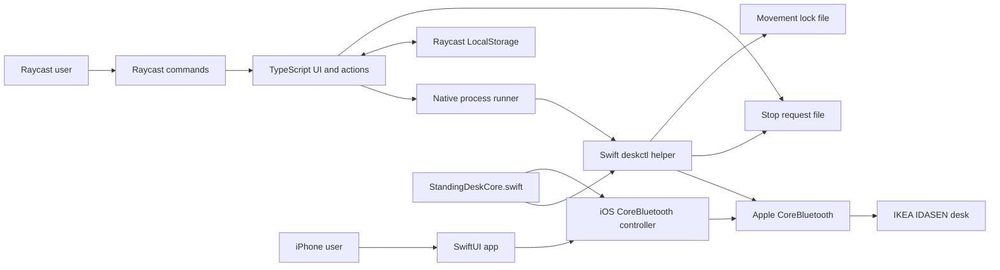

# Architecture

## Overview

The repository contains a Raycast extension and a native iPhone app. Both use shared Swift protocol and movement-policy code.

The Raycast extension delegates CoreBluetooth operations to a signed Swift helper. The iPhone app owns its CoreBluetooth session in-process.

## Components

### Raycast manifest

`package.json` defines the command entry points and pins the Raycast API to the installed stable runtime.

### Management view

`src/manage-desk.tsx` renders desk status, presets, adjustment actions, custom height input, and recovery actions. It streams native progress into the visible height and toast messages.

### Menu-bar view

`src/desk-menu.tsx` renders an icon-only macOS menu-bar item. Its menu shows the last reported height without opening Bluetooth during startup. It hands movement and save actions to dedicated Raycast commands so work continues after the menu closes. Manual refresh remains available for a current reading.

### Direct commands

The Sit, Stand, Raise, Lower, Stop, Save Sit, and Save Stand entry points call shared functions in `src/quick-command.ts`.

### Domain and persistence

`src/model.ts` defines safe defaults and validates configuration and target heights. `src/storage.ts` stores settings, presets, an explicit desk selection, the last reported height, and a desk-scoped safety acknowledgement through Raycast `LocalStorage`. Each selection has an opaque generation token. Cached events and acknowledgements apply only to that generation, so stale processes cannot change or populate another desk's state.

Movement and status commands require an explicit desk selection. Only discovery can use the Bluetooth name filter. Settings, calibration, restore, and forget operations publish Stop requests before and after changing desk-bound state.

### Native process bridge

`src/native.ts` validates settings, snapshots the selected desk, starts `assets/deskctl`, parses newline-delimited JSON events, and updates desk-scoped cached status.

The bridge uses two support files:

- `stop-request` stores the latest movement request identifier. A newer request cancels an older helper.
- `movement.lock` prevents concurrent movement helpers.

### Bluetooth helper

`native/DeskBLE.swift` discovers nearby desks, connects to the selected desk, resolves required characteristics, reads height, and sends movement commands. It emits `device`, `status`, `progress`, `complete`, and `error` events as JSON lines.

The `discover` operation runs for five seconds. It reports the remembered peripheral, compatible peripherals connected to macOS, and nearby advertisements matching the desk service or name filter. It does not connect to a peripheral or write Bluetooth characteristics.

`scripts/build-native.sh` compiles `arm64` and `x86_64` executables in `.raycast-swift-build`. It combines them with `lipo`, embeds `native/Info.plist`, and applies an ad-hoc signature.

### Shared Swift core

`native/StandingDeskCore.swift` defines protocol UUIDs, payloads, height conversions, configuration validation, nudge bounds, and movement evaluation.

The macOS helper and iOS target compile the same file. Platform adapters remain responsible for process or application lifecycle.

### iPhone app

`ios/StandingDesk.xcodeproj` builds the iOS 17 application and its unit tests.

The system launch screen uses the shared black desk symbol centered on a fixed white background. The main toolbar loads the same vector asset.

The app localizes its interface, safety text, errors, Bluetooth privacy description, and quick actions in Spanish, French, Italian, and German.

`AppShortcuts.swift` registers localized Sit and Stand Home Screen quick actions. The scene delegate queues cold-launch and connected-scene actions. `ControllerView` consumes them only while the scene is active, then uses the normal safety acknowledgement and movement path.

`DeskBluetoothController` serializes discovery, status, movement, settings mutations, and Stop operations on the main actor. It retrieves only the explicitly selected iPhone-local CoreBluetooth identifier for status and movement.

The latest request replaces older queued work. If an older movement might have sent a target, the replacement waits behind a confirmed Stop. Control writes with responses run one at a time. For those characteristics, target writes start only after both setup writes succeed; otherwise they start after the bounded setup delay. Explicit Stop discards queued movement and settings work.

The app stores configuration, presets, selection generation, and the first-use safety acknowledgement in `UserDefaults`. It also stores the acknowledgement under an independent key, so malformed settings data cannot present the checklist again. Tolerant decoding preserves valid fields when the stored schema changes or one field is malformed. It persists normalized migrations immediately, and re-selecting the same desk keeps its generation stable.

The safety acknowledgement persists for the app data lifetime. Desk selection and configuration changes do not present the checklist again.

## Raycast movement sequence

1. The bridge publishes a unique movement request identifier before it awaits desk-bound state.
2. The bridge loads validated configuration and snapshots the explicit desk selection.
3. The bridge verifies the safety acknowledgement for that exact selection.
4. TypeScript validates the requested movement against the configured bounds.
5. An active helper detects the new identifier and stops.
6. The new helper waits up to five seconds for the movement lock.
7. A superseded helper exits without connecting to the desk.
8. CoreBluetooth connects only to the snapshotted desk identifier.
9. The helper reads the current height.
10. The helper wakes and stops the controller before movement.
11. The helper writes the target every 400 milliseconds.
12. Height notifications and explicit reads update progress.
13. The helper sends Stop after two readings within `0.25 cm`.

Movement also stops after cancellation, a stall, a Bluetooth error, or 45 seconds.

## iPhone movement sequence

1. The controller snapshots the selected desk, selection generation, and validated configuration.
2. It replaces stale queued work with a new request generation.
3. A replacement waits for confirmed Stop when an older movement could have sent a target.
4. CoreBluetooth connects only to the snapshotted desk identifier.
5. The controller reads height before it sends a movement target.
6. It serializes Wake and Stop setup writes and waits for acknowledgements when the characteristic supports responses.
7. It writes the target every 400 milliseconds and evaluates height updates.
8. It prioritizes a final Stop after success, replacement, failure, lifecycle exit, stall, or timeout.

## Failure boundaries

- Raycast owns user feedback. The extension owns settings and saved positions.
- The bridge owns process lifecycle and inter-process cancellation.
- The helper owns protocol validation and emergency stop writes.
- The physical controller remains the final stop mechanism.

No layer assumes that a software stop always succeeds.

## iOS lifecycle boundary

The iPhone app does not declare the CoreBluetooth background mode. Movement is foreground-only, including movement requested from a Home Screen quick action.

The app disables screen auto-lock during movement. When the scene becomes inactive, it invalidates the active request, cancels target writes, and sends Stop. When the scene becomes active, it refreshes the remembered desk height.

A short UIKit background task protects final Stop delivery. Its expiration handler performs immediate best-effort cleanup and tells the user when Stop was not confirmed.

Latest-request-wins coordination is local to each application. The Raycast lock and iOS request generation cannot coordinate across devices. Do not control movement from macOS and iPhone simultaneously.
