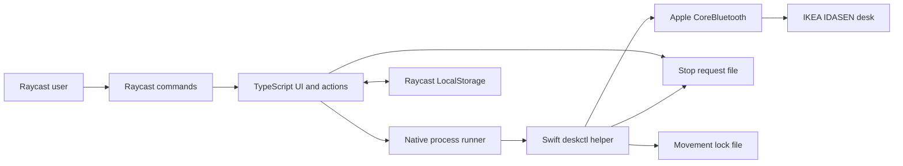

# Architecture

## Overview

The extension separates Raycast user interface code from physical Bluetooth control. A signed Swift helper owns all CoreBluetooth operations.

## Components

### Raycast manifest

`package.json` defines the command entry points and pins the Raycast API to the installed stable runtime.

### Management view

`src/manage-desk.tsx` renders desk status, presets, adjustment actions, custom height input, and recovery actions. It streams native progress into the visible height and toast messages.

### Menu-bar view

`src/desk-menu.tsx` keeps the current height and common actions available from the macOS menu bar. It can open the full management view for custom-height and recovery actions.

### Direct commands

The Sit, Stand, Raise, Lower, Stop, Save Sit, and Save Stand entry points call shared functions in `src/quick-command.ts`.

### Domain and persistence

`src/model.ts` validates configuration and target heights. `src/storage.ts` stores presets, the selected desk identifier, and the safety acknowledgement through Raycast `LocalStorage`.

### Native process bridge

`src/native.ts` validates settings, starts `assets/deskctl`, parses newline-delimited JSON events, and updates the stored desk identifier.

The bridge uses two support files:

- `stop-request` lets another Raycast command cancel active movement.
- `movement.lock` prevents concurrent movement helpers.

### Bluetooth helper

`native/DeskBLE.swift` discovers the desk, connects, resolves required characteristics, reads height, and sends movement commands. It emits `status`, `progress`, `complete`, and `error` events as JSON lines.

`scripts/build-native.sh` compiles `arm64` and `x86_64` executables. It combines them with `lipo`, embeds `native/Info.plist`, and applies an ad-hoc signature.

## Movement sequence

1. TypeScript validates the requested target.
2. The bridge removes a stale stop request.
3. The helper obtains the movement lock.
4. CoreBluetooth discovers and connects to the desk.
5. The helper reads the current height.
6. The helper wakes and stops the controller before movement.
7. The helper writes the target every 400 milliseconds.
8. Height notifications and explicit reads update progress.
9. The helper stops after two readings within `0.25 cm`.

Movement also stops after cancellation, a stall, a Bluetooth error, or 45 seconds.

## Failure boundaries

- Raycast owns preferences, user feedback, and saved positions.
- The bridge owns process lifecycle and inter-process cancellation.
- The helper owns protocol validation and emergency stop writes.
- The physical controller remains the final stop mechanism.

No layer assumes that a software stop always succeeds.
